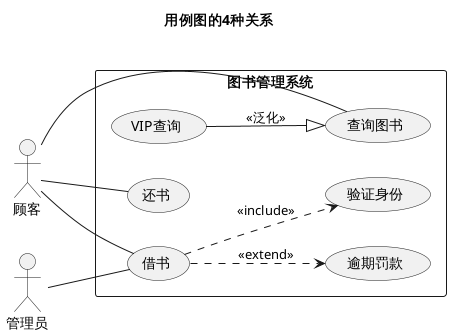
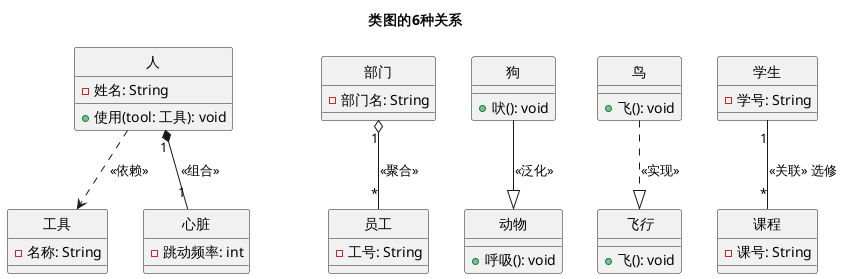
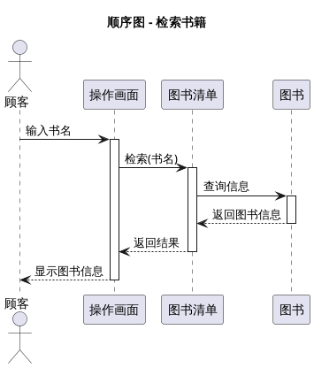
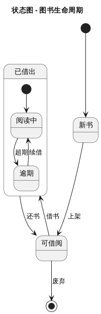
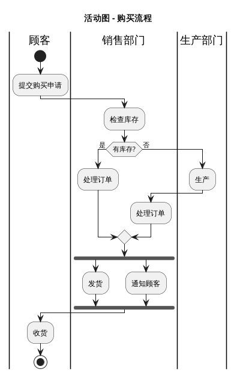
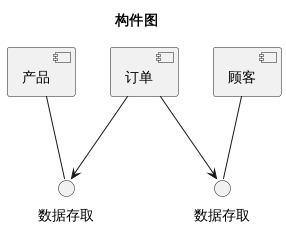
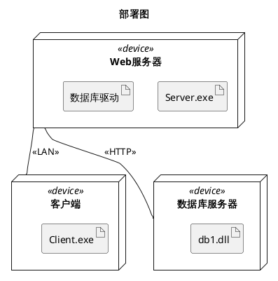

说明: 该文件来自AI生成PPT，人工筛选重点书写。
By: 空里流霜不觉飞
有问题可以联系: hanchenyuan@mail.nwpu.eu.cn

---

## 课程信息
- **试卷构成**：Java 50% + UML 50%
- **成绩构成**：期末70% + 平时30%

---

## 第1章 Java语言基础

### 编译与运行

```
.java源文件 → javac编译 → .class字节码 → JVM执行
```

**JVM运行模式**：
- 解释执行：逐条翻译字节码（慢）
- JIT编译：热点代码编译为本地代码（快）
- 混合模式：默认，两者结合

**vs C#**：Java字节码跨平台，JVM各平台不同；C#的IL需要CLR

---

### Java符号集

Java符号集分为5种类型：**标识符、关键字、常量、运算符、分隔符**

---

**注释**
```java
// 单行注释
/* 多行注释 */
/** 文档注释（Javadoc） */
```

**标识符**
- 组成：字母、数字、`_`、`$`
- 不能以数字开头，大小写敏感，不能是关键字

| 类型 | 规则 | 示例 |
|------|------|------|
| 类名 | 大驼峰 | `HelloWorld` |
| 方法/变量 | 小驼峰 | `getScore` |
| 常量 | 全大写下划线 | `MAX_VALUE` |
| 包名 | 全小写 | `cn.edu.nwpu` |

**变量作用域**
- 类成员变量：作用域为整个类
- 方法局部变量：从定义处到所在块结束
- Java不允许嵌套块内声明同名变量（C#允许）

**关键字**（50个）

```
abstract   assert     boolean    break      byte       case
catch      char       class      const      continue   default
do         double     else       enum       extends    final
finally    float      for        goto       if         implements
import     instanceof int        interface  long       native
new        package    private    protected  public     return
short      static     strictfp   super      switch     synchronized
this       throw      throws     transient  try        void
volatile   while
```

- `const`和`goto`是保留字，但未使用
- `true`、`false`、`null`是保留字，但不是关键字
- **vs C#**：Java没有`internal`、`delegate`、`event`等

**数据类型与默认值**

| 类型 | 字节 | 默认值 | 取值范围 |
|------|------|--------|----------|
| boolean | 1 | false | true/false |
| byte | 1 | 0 | -128~127 |
| short | 2 | 0 | -32768~32767 |
| int | 4 | 0 | -2³¹~2³¹-1 |
| long | 8 | 0L | -2⁶³~2⁶³-1 |
| float | 4 | 0.0f | ±3.4E38 |
| double | 8 | 0.0d | ±1.7E308 |
| char | 2 | '\u0000' | Unicode |
| 引用 | - | null | - |

**vs C#**：Java没有无符号类型；boolean不能当整数用

**常量表示**

整数常量：
```java
int a = 42;          // 十进制
int b = 0x2A;        // 十六进制（0x前缀）
int c = 052;         // 八进制（0前缀）
int d = 0b101010;    // 二进制（0b前缀，JDK7+）
long e = 100_000L;   // long型（L后缀），可加下划线分隔
```

浮点常量：
```java
float f = 3.14f;     // float（f后缀）
double g = 3.14;     // 默认double
double h = 3.14d;    // double（d后缀，可选）
double i = 1.5E10;   // 科学计数法
```

字符常量：
```java
char c1 = 'A';           // 单引号内单个字符
char c2 = '\n';          // 转义字符
char c3 = '\101';        // 八进制位模式（表示'A'）
char c4 = '\u0041';      // 十六进制Unicode（表示'A'）
```

字符串常量：
```java
String s1 = "Hello";                // 双引号内
String s2 = "Hello\nWorld";         // 支持转义
String s3 = "He said \"Hi\"";       // 双引号转义
String s4 = "Path: C:\\Users";      // 反斜杠转义
```

布尔常量：
```java
boolean b1 = true;
boolean b2 = false;
```

**转义字符**

| 转义 | 含义 |
|------|------|
| `\n` | 换行 |
| `\t` | 制表 |
| `\r` | 回车 |
| `\\` | 反斜杠 |
| `\'` | 单引号 |
| `\"` | 双引号 |
| `\ooo` | 八进制位模式 |
| `\uxxxx` | 十六进制Unicode |

**运算符**（与C#基本相同）

| 类型 | 运算符 |
|------|--------|
| 算术 | `+ - * / % ++ --` |
| 关系 | `> >= < <= == !=` |
| 逻辑 | `&& \|\| !` |
| 位 | `& \| ^ ~ << >> >>>` |
| 赋值 | `= += -= *= /= %=` |
| 其他 | `?: instanceof . [] ()` |

**短路与不短路**：
- `&&` 短路与：左边为false，右边不执行
- `||` 短路或：左边为true，右边不执行
- `&` 不短路与：两边都执行
- `|` 不短路或：两边都执行

**Java特有**：
- `>>>` 无符号右移（高位补0，C#没有）
- `instanceof` 类型检查（C#用`is`）
- `==` 比较对象引用（C#比较值）

**运算符优先级**（从高到低）

| 优先级 | 运算符 |
|--------|--------|
| 1 | `()` `[]` `.` |
| 2 | `++` `--` `!` `~` `(type)` `new` |
| 3 | `*` `/` `%` |
| 4 | `+` `-` |
| 5 | `<<` `>>` `>>>` |
| 6 | `<` `<=` `>` `>=` `instanceof` |
| 7 | `==` `!=` |
| 8 | `&` |
| 9 | `^` |
| 10 | `\|` |
| 11 | `&&` |
| 12 | `\|\|` |
| 13 | `?:` |
| 14 | `=` `+=` `-=` 等 |

**类型转换**

扩展转换（自动，不丢失信息）：
```
byte → short → int → long → float → double
char → int → long → float → double
```

窄化转换（强制，可能丢失信息）：
```java
double d = 3.99;
int i = (int) d;  // i = 3，截断小数
```

其他转换：
- 字符串转数值：`Integer.parseInt("123")`、`Double.parseDouble("3.14")`
- 数值转字符串：`String.valueOf(123)`、`"" + 123`

**数字提升**：
- 一元：`byte`/`short`/`char` 运算时提升为 `int`
- 二元：两个操作数提升为共同类型（至少int）

**分隔符**
```
{}      // 代码块
[]      // 数组
()      // 方法参数/表达式
;       // 语句结束
,       // 分隔
.       // 成员访问
@       // 注解（如 @Override）
::      // 方法引用（JDK8+，如 System.out::println）
...     // 可变参数（如 int... args）
```

---

### 代码结构脚本

```java
// ========== 1. 包声明 ==========
package cn.edu.nwpu.cs;  // 必须在文件开头，最多一个

// ========== 2. 导入 ==========
import java.util.Scanner;     // 导入单个类
import java.util.*;            // 导入整个包
import static java.lang.Math.*; // 静态导入（C#无此特性）

// ========== 3. 类声明 ==========
[public] [abstract|final] class 类名 [extends 父类] [implements 接口] {
    // 类体
}

// ========== 4. 变量声明 ==========
int x;                    // 局部变量（无默认值，必须初始化）
static int count = 0;     // 静态变量
private String name;      // 实例变量
final int MAX = 100;      // 常量（类似C# const/readonly）

// ========== 5. 方法声明 ==========
[public|protected|private] [static] 返回类型 方法名(参数列表) [throws 异常] {
    // 方法体
    return 值;
}
```

**vs C#**：
- Java用`extends`继承（C#用`:`）
- Java用`implements`实现接口（C#用`:`）
- Java用`this.`访问实例成员（C#可选）
- Java的`main`必须是`public static void`（C#可省略`static`）

---

## 第2章 控制语句

**与C#基本相同**：if/else, switch, while, do-while, for, break, continue

**差异点**：
- **变量作用域**：Java不允许嵌套块内同名变量（C#允许）
- **switch**：Java支持String（JDK7+）
- **foreach**：`for (int item : arr) { }` 语法相同

**异常处理**
- Java检查型异常：编译器强制处理（C#无此概念）
- IOException, SQLException等必须try-catch或throws
- RuntimeException及其子类不强制处理

---

## 第3章 函数（方法）

**参数传递**：Java全是值传递（C#有ref/out可传递引用）

**可变参数**：`void method(int... args)` （C#用`params`）

**命令行参数**：`public static void main(String[] args)`

**静态导入**（C#无此特性）
```java
import static java.lang.Math.*;
// 可直接用 sqrt(), PI 而不用 Math. 前缀
```

---

## 第4章 对象和类

### 访问控制差异

| 修饰符 | Java | C# |
|--------|------|-----|
| public | 相同 | 相同 |
| private | 相同 | 相同 |
| protected | 同包+子类 | 仅子类 |
| 默认(包访问) | 同包可见 | 无此概念 |

### 构造函数差异
- **this()**：调用其他构造函数（C#用`: this()`）
- **super()**：调用父类构造函数（C#用`: base()`）
- 如果有自定义构造函数，**默认无参构造不再提供**

### final关键字
- **final变量**：常量（C#用const/readonly）
- **final方法**：不能被重写（C#用sealed）
- **final类**：不能被继承（C#用sealed）

### 包装类（装箱拆箱）

| 基本类型 | 包装类 |
|----------|--------|
| int | Integer |
| char | Character |
| boolean | Boolean |
| double | Double |

```java
int x = 5;
Integer obj = x;      // 自动装箱
int y = obj;          // 自动拆箱
```

### 枚举类型（Java枚举是类）
```java
enum Color {
    RED, BLUE, GREEN;
    
    // 可以有字段、方法、构造函数
    private String hex;
    Color() { this.hex = "000"; }
}
```
**vs C#**：Java枚举是类（可有字段方法），C#枚举是值类型

---

## 第5章 多态、接口及内部类

### 类型转换

| 转换 | Java | C# |
|------|------|-----|
| 向上转型 | 隐式 | 隐式 |
| 向下转型 | 显式，可能ClassCastException | 显式，可能InvalidCastException |
| 类型检查 | `instanceof` | `is` |

### 接口差异

| 特性 | Java | C# |
|------|------|-----|
| 默认方法 | 支持（JDK8+） | 支持 |
| 静态方法 | 支持（JDK8+） | 支持 |
| 私有方法 | 支持（JDK9+） | 不支持 |

### 内部类
- Java支持：成员内部类、静态内部类、局部内部类、匿名内部类
- C#支持：成员内部类、静态内部类（用Lambda替代匿名内部类）

```java
// 匿名内部类（Java特有）
button.setOnClickListener(new OnClickListener() {
    @Override
    public void onClick(View v) { }
});
```

---


## 第6章 建模与UML

**建模的目的**：验证（建造前先模拟）、交流（与客户沟通）、可视化（展示结构和机理）、降低复杂度（抽象重要部分）

**抽象**：提取事物重要方面，抛弃不重要的。没有完全"正确"的模型，只有充分和不充分的模型。

**面向对象四大特征**

| 特征 | 含义 | 示例 |
|------|------|------|
| 标识(Identity) | 对象是离散可辨识的实体，即使属性值全同，两个对象也有差别 | 张三的车 vs 李四的车 |
| 分类(Classification) | 相同属性和行为的对象归为一类，类是抽象，对象是实例 | 汽车类 → 多个汽车对象 |
| 继承(Inheritance) | 子类继承父类的属性和操作，减少重复设计 | 中学生/大学生 → 学生 |
| 多态(Polymorphism) | 同一消息对不同类产生不同动作 | "考试"对中学生/大学生含义不同 |

**OO建模阶段**：需求分析（概念世界）→ 系统分析（做什么，不怎么做）→ 系统设计（策略选择）→ 类的设计（数据结构+算法）→ 实现（转为代码）

**UML定义**：统一建模语言，OMG标准化，与具体开发语言/过程无关。最新标准UML 2.5.1（2017）

**UML统一的意义**：各种表示法统一、全生命期统一、应用领域统一、编程语言和平台统一、不同开发过程统一、内部概念统一

**UML三种模型**

| 模型 | 关注点 | 对应图 | 比喻 |
|------|--------|--------|------|
| 类模型 | 静态结构（数据） | 类图、对象图 | 数据层面 |
| 状态模型 | 时序行为（控制） | 状态图 | 控制层面 |
| 交互模型 | 对象协作（交互） | 用例图、顺序图、活动图 | 交互层面 |

三种模型互相引用：类模型定义操作，状态/交互模型详细描述这些操作

**UML 13种图形**（UML1.5 9种 + UML2.0 新增4种）

| 类型 | 图名 | 概要 |
|------|------|------|
| 静态结构 | **类图** | 系统的静态结构（类的属性、操作、关系） |
| 静态结构 | **对象图** | 某一时刻对象的状态快照 |
| 静态结构 | **包图** | 模型元素分组整理（UML2.0新增） |
| 静态结构 | **组合结构图** | 类的内部结构详述（UML2.0新增） |
| 动态行为 | **状态图** | 对象生命周期内的状态迁移 |
| 动态行为 | **活动图** | 业务流程/算法的步骤序列 |
| 交互 | **用例图** | 外部用户看到的系统功能 |
| 交互 | **顺序图** | 按时间顺序的消息交互 |
| 交互 | **通信图**(协作图) | 以连接关系为中心的消息交互 |
| 交互 | **交互概览图** | 多个交互的控制关系鸟瞰（UML2.0新增） |
| 交互 | **时序图** | 生命线状态随时间变化（UML2.0新增） |
| 实现 | **构件图** | 软件构件的结构和关系 |
| 实现 | **部署图** | 运行时硬件节点和通信 |

**UML建模概念域**：
- **静态结构**：确定应用中的关键概念及其关系
- **动态行为**：对象的生命历史 + 对象间通信方式
- **实现构造**：逻辑设计（类图）vs 物理实现（部署图）
- **模型组织**：包，用于存储、访问控制、管理
- **扩展机制**：构造型(<<>>)、标记值、约束

---

## 第7章 用例图

用例图处于分析设计的前奏，是需求阶段到计算机世界的第一步。不涉及具体技术，主要用于开发人员与用户沟通。

**用例图组成**：参与者(Actor) + 用例(Use Case) + 关联 + 系统边界

**参与者**：系统外部与系统进行信息交换的人、物或其他系统。存在于系统之外。
- **主动参与者**：主动发起与系统的交互（如用户）
- **被动参与者**：只参与交互但不发起（如外部数据库）
- 参与者可以泛化：子参与者继承父参与者关联的用例

**用例**：系统提供的一个功能或服务，由参与者与系统之间的一系列消息描述

**用例图的作用**：(1)功能-做什么(what) (2)结构-谁来做(who) (3)行为-怎么做(how)

**用例建模步骤**：
1. 确定系统边界
2. 找出参与者（谁使用系统？谁提供/获取信息？谁启动/关闭系统？）
3. 确定用例（参与者需要什么功能？）
4. 确定用例之间的关系

**用例关系**（考试重点）

| 关系 | 符号 | 含义 | 方向 | 示例 |
|------|------|------|------|------|
| 关联 | 实线 | 参与者与用例之间 | 双向 | 顾客——借书 |
| 泛化 | △ | 用例间或参与者间继承 | 子→父 | VIP顾客→顾客 |
| 包含(include) | --▷《include》 | A **必须**包含B | A→B | 借书《include》验证身份 |
| 扩展(extend) | --▷《extend》 | A可选扩展B | B→A | 借书《extend》逾期罚款 |



**包含 vs 扩展**（易混淆点）：
- **包含**：基础用例→被包含用例，必须执行的公共步骤提取出来
- **扩展**：扩展用例→基础用例，可选的附加行为

**识别用例的检查清单**：
- 参与者是否要读取/创建/修改/删除系统信息？
- 参与者是否需要通知系统外部事件？
- 系统是否需要通知参与者某些事件？

---

## 第8章 类图与对象图

**类的表示**：`类名 | 属性 | 操作`（三栏）

**可见性符号**

| 符号 | 含义 | **vs C#** |
|------|------|-----------|
| `+` | public | 相同 |
| `-` | private | 相同 |
| `#` | protected | 相同 |
| `~` | package(包访问) | C#无此概念 |

**属性表示法**：`可见性 属性名:类型 [多重性] = 默认值 {约束}`
- 下划线 = 静态成员（如 `-count:int`）
- `/`前缀 = 派生属性（由其他属性计算得来，如 `/age:int`）

**操作表示法**：`可见性 方法名(参数列表):返回类型 {约束}`
- 斜体 = 抽象方法
- 下划线 = 静态方法

**抽象类**：类名*斜体*，可有抽象方法
**接口**：`<<interface>>`构造型，只有抽象方法（JDK8前）

**类元(Classifier)**：比类更通用的术语，包括类、接口、数据类型、构件、参与者、信号、节点等

**类图的6种关系**（考试重点）

| 关系 | 线型 | 箭头 | 含义 | 耦合度 | 示例 |
|------|------|------|------|--------|------|
| 依赖 | 虚线 | → | 一个类使用另一个类（临时性） | 最弱 | 人→工具 |
| 关联 | 实线 | 可有导航 | 结构性关系（长期持有引用） | 弱 | 学生—课程 |
| 聚合 | 实线 | ◇→ | 整体-部分(弱，生命周期独立) | 中 | 部门◇—员工 |
| 组合 | 实线 | ◆→ | 整体-部分(强，同生共死) | 强 | 人◆—心脏 |
| 泛化 | 实线 | △ | 继承(is-a) | — | 狗△动物 |
| 实现 | 虚线 | △ | 接口实现 | — | 类△接口 |



**聚合 vs 组合**：
- 聚合：部分可以脱离整体独立存在（部门解散，员工还在）
- 组合：部分不能脱离整体（人死了，心脏也没了）

**关联的细节**：
- **关联名**：描述关系性质（如"选修"），可加方向三角
- **角色名**：关联端的名称（如学生端叫"选修者"）
- **导航性**：箭头表示可沿此方向访问
- **多重度**：`1`恰好一个、`0..1`零或一个、`*`零或多个、`1..*`一或多个、`n..m`范围

**多重度读法**：从对方看——"一个学生可以选修0..*门课程"，"一门课程可以被0..*个学生选修"

**关联类**：关联本身可以有属性，用虚线连到一个类框
```
学生 —— 选修 —— 课程
         |
       成绩（关联类的属性）
```

**对象图**：类图在某一时刻的实例快照，显示对象的状态和关系。用于验证类图的多重度设计。

**包设计四原则**：
- **重用等价原则(REP)**：包作为可重用单元，方便版本管理
- **共同闭包原则(CCP)**：需要同时改变的类放同一包（提高内聚）
- **共同重用原则(CRP)**：不会一起使用的类不放同一包（减少不必要的依赖）
- **非循环依赖原则(ADP)**：包之间不能有循环依赖（合并或提取公共元素消除）

CCP和CRP相互排斥：CCP希望包大，CRP希望包小。早期以CCP为主，稳定后以REP+CRP为主。

**包之间的关系**：依赖（包内元素有使用关系）和泛化（包内元素有继承关系）。应尽量避免双向依赖。

**逆向工程**：从代码自动生成类图。不同工具（Rose、PowerDesigner、StarUML、EA等）生成结果有差异。

---

## 第9章 顺序图与协作图

**交互图**：描述对象间动态协作关系及行为次序，常用来描述一个用例的行为。

顺序图以对象为中心描述消息的时间顺序；协作图以对象间连接关系为中心描述消息交互。两者可互相转换（简单的）。

**顺序图元素**

| 元素 | 表示 | 含义 |
|------|------|------|
| 生命线(Lifeline) | 竖直虚线 | 对象存在的时间段 |
| 激活(Activation) | 窄矩形 | 对象执行操作的时间段 |
| 同步消息 | 实线实心箭头 | 调用并等待返回 |
| 返回消息 | 虚线开放箭头 | 方法返回 |
| 异步消息 | 实线开放箭头 | 调用后不等待 |



**消息编号**：嵌套编号表示调用层次（如1, 1.1, 1.2, 2）

**交互片段(Interaction Fragment)** — UML2.0新增：

| 操作符 | 含义 | 示例 |
|--------|------|------|
| `alt` | 条件分支（if-else） | [已登录] / [未登录] |
| `opt` | 可选执行（if） | [有库存] |
| `loop` | 循环 | [i<10] |
| `break` | 中断 | [超时] |
| `par` | 并行执行 | |
| `ref` | 引用其他交互 | |

**协作图(通信图)**：消息编号用`序号:表达式`格式（如`1:search(title)`），用带编号的箭头表示消息流向。

---

## 第10章 状态图

状态图描述一个对象从生成到消失整个生命周期的状态变化。不是所有对象都需要画状态图，只有生命周期内有复杂状态变化的才需要。



**状态的内部活动**

| 标签 | 含义 | 时机 |
|------|------|------|
| `entry/` | 入口动作 | 进入状态时执行一次 |
| `do/` | 内部活动 | 状态持续期间执行 |
| `exit/` | 出口动作 | 离开状态时执行一次 |
| `事件[条件]/` | 内部转换 | 特定事件触发 |

**转换(Transition)五要素**：事件 + 源状态 + 目标状态 + 监护条件 + 动作

格式：`事件 [监护条件] / 动作`

**事件类型**：
- **调用事件**：收到消息调用（如`borrow()`）
- **信号事件**：接收到异步信号
- **变化事件**：条件变为true（如`when(温度>100)`）
- **时间事件**：到达某个时间点（如`after(5s)`）

**特殊状态**：初始状态●（一个）→ 终止状态◎（可多个）

**复合状态/子状态**：状态可以包含子状态图，将复杂状态分解

**历史状态**：
- **浅历史(H)**：恢复到上次离开该组合状态时的子状态（不嵌套）
- **深历史(H\*)**：恢复到嵌套最深层的子状态

---

## 第11章 活动图与包图

活动图是特殊的状态图，对计算流程和工作流建模。与顺序图的区别：顺序图偏重对象，活动图偏重操作。

**活动状态 vs 动作状态**：
- **活动状态**：可分解、可被中断、等待计算完成
- **动作状态**：原子操作、不可中断（如更新变量、发送消息）

**活动图模型元素**

| 元素 | 符号 | 含义 |
|------|------|------|
| 初始节点 | ● | 流程起点 |
| 活动(圆角矩形) | 圆角框 | 一个步骤 |
| 判断节点(Decision) | ◇ | 分支条件 |
| 合并节点(Merge) | ◇ | 分支合并 |
| 分叉节点(Fork) | 粗横线 | 并行开始（一分多） |
| 汇合节点(Join) | 粗横线 | 并行同步（多合一） |
| 终止节点 | ◎ | 流程结束 |
| 泳道(Swimlane) | 竖/横分区 | 按责任分区 |
| 对象节点 | 矩形 | 数据对象 |



**Fork vs Decision**：
- Fork：一个控制流分成多个**并行**流（粗横线）
- Decision：一个控制流按条件分成多个**互斥**流（◇菱形）

**Join vs Merge**：
- Join：多个并行流汇合成一个（必须等所有流到达）
- Merge：多个互斥流汇合（只要一个到达即可）

**对象流**：活动图中可以显示数据对象的流动

**信号**（UML2.0）：
- **发送信号**：凸五边形，异步发送
- **接收信号**：凹五边形，接收后触发
- **时间信号**：沙漏形，时间事件触发

**中断区**：虚线框包围的活动中，收到中断事件后全部停止，控制转向中断边（齿形箭头）

**子活动图**：复杂活动图中，将一组相关活动封装为子活动图，主图中用简图替代（带叉齿符标记）

**包图**：对UML模型元素分组整理，提高可读性和可维护性
- 包可以嵌套（层次化），但层次不要过深
- 包没有实例（运行时不可见）
- 包名修饰类名：`包名::类名`
- 包之间关系：依赖和泛化（取决于包内元素的关系）
- 应避免双向依赖

**注释(Note)**：带折角矩形框，对UML元素添加解释/约束/补充信息。和包一样属于公用机制，可用于任何UML元素。

---

## 第12章 物理视图

物理视图描述系统"看得到"的部分：文件构成、软件运行环境、硬件构成。

### 构件图

**构件(Component)**：系统内预先定义好访问接口的可再利用软件部件。具有封装性、可插拔、独立性。

- UML1.x中：数据文件、DLL、可执行文件等都被定义为组件
- UML2.0中：统称为**工件(artifact)**，组件更偏向逻辑概念

**构件的表示**：
- 有小图标时可省略`<<component>>`
- **黑盒视图**：只显示公共属性和操作（外部可见）
- **白盒视图**：显示私有属性和实现类元（内部结构）

**接口**：构件之间通过接口连接，接口只定义操作调用方法，不含具体实现
- **提供接口(Provided)**：构件提供给外部的服务（棒棒糖符号）
- **需求接口(Required)**：构件访问外部需要的服务（半圆符号）

使用接口的好处：保持接口不变即可置换构件内部实现



**构件内部结构**（UML2.0）：
- **部分(Part)**：构件的组成部分
- **端口(Port)**：构件内外的边界，一个端口可连接多个接口
- **连接(Connect)**：连接组成部分，可指定连接端名和多重度

**构件间关系**：类似类的依赖关系，表示访问调用关系

### 部署图

**节点(Node)**：运行时的计算资源（有内存和处理能力的硬件设备+运行环境）
- `<<device>>`：物理设备（服务器、打印机等）
- `<<executionEnvironment>>`：运行环境（OS、容器等）

**节点类型 vs 节点实例**：类似类与对象，节点实例名有下划线

**成果物(Artifact)**：系统使用的物理文件（源码、可执行文件、数据库文件等），用`<<artifact>>`表示

**部署关系**：
- 成果物与节点：`<<deploy>>`依赖
- 成果物与构件：`<<manifest>>`依赖（实现关系）



**节点间关系**：实线表示通信连接，可加构造型（如`<<LAN>>`、`<<HTTP>>`）和多重度

### UML2.0新增图形（了解）

| 图名 | 用途 |
|------|------|
| 组合结构图 | 详述类的内部结构（组成部分+连接+多重度） |
| 时序图 | 生命线状态随时间变化，兼有顺序图的消息交互 |
| 交互概览图 | 用活动图形式描述多个交互的控制关系 |

---

## 重点总结

**Java特有概念**：
1. 包访问权限（无修饰符，同包可见）
2. 静态导入
3. 枚举是类（可有字段方法）
4. 匿名内部类
5. 检查型异常
6. 数组.length是属性
7. ==比较引用，equals比较值

**UML考试重点**：
1. 类图的6种关系（依赖→关联→聚合→组合→泛化→实现）
2. 用例图的4种关系（关联、泛化、include、extend，注意方向）
3. 顺序图的消息类型和交互片段
4. 状态图的状态转换五要素
5. 活动图的分支与并行（Fork/Join vs Decision/Merge）
6. 构件图的提供接口vs需求接口
7. 部署图的节点类型vs实例、deploy vs manifest
8. 包设计四原则
